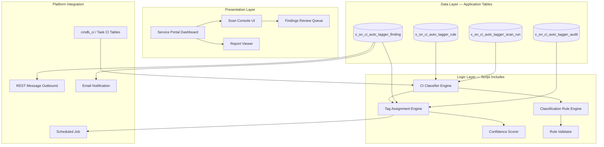

# ServiceNow CI Auto Tagger (sn_ci_auto_tagger)

**Scope Prefix:** `x_sn_ci_auto_tagger`
**Repository:** `vladarchitectservicenow-oss/sn_ci_auto_tagger`
**License:** AGPL-3.0-only
**Author:** Vladimir Kapustin — ServiceNow Solution Architect

## Overview

CI Auto Tagger is an enterprise-grade ServiceNow scoped application that automates the classification and tagging of Configuration Items (CIs) in the ServiceNow CMDB. Every enterprise ServiceNow instance accumulates thousands of CIs over its lifetime — servers, network devices, applications, cloud resources, and database instances — many of which enter the CMDB through automated discovery, manual imports, or integration feeds without consistent classification. The result is a CMDB that grows increasingly chaotic: CIs with missing or incorrect classes, unlabeled assets that evade governance policies, and configuration drift that undermines the reliability of ITOM, ITSM, and security workflows.

This product solves that problem by automatically analyzing CI attributes — name patterns, type fields, relationships, operational statuses, and associated configuration data — and assigning accurate class labels and governance tags. It uses a combination of regex-based pattern matching and attribute scoring to classify CIs into their correct CI class hierarchy, then tags them with operational metadata such as environment type, criticality tier, compliance scope, and data sensitivity. The result is a self-healing CMDB where every CI has a verified classification and a complete set of operational tags, enabling accurate impact analysis, proper change risk assessment, and reliable service mapping.

Unlike static classification scripts that run once and leave stale results, CI Auto Tagger operates continuously. It can be scheduled to run nightly scans of recently modified CIs, full weekly audits of the entire CMDB, or on-demand classification passes triggered by discovery completion events. Every run produces an audit log, a classification confidence report, and a summary of changes applied, giving CMDB administrators full visibility and control over automated decisions.

## Problem Statement

ServiceNow CMDBs in production environments routinely contain 50,000 to 500,000 CIs. Discovery tools populate these records, but classification accuracy degrades over time. Common failure modes include:

- **Missing class assignments:** CIs created via REST API or integration middleware often lack a `sys_class_name`, making them invisible to class-specific dashboards, reports, and automation.
- **Incorrect classifications:** A Windows server discovered as a generic `cmdb_ci_computer` instead of `cmdb_ci_win_server` misses Windows-specific patching policies, vulnerability scans, and license tracking.
- **Inconsistent tagging:** CIs tagged as "Production" in one data center but "PROD" in another break environment-level filtering in change management and incident routing.
- **Orphaned CIs:** Relationships pointing to deleted or merged CIs create broken service maps and unreliable impact analysis.
- **Regulatory blind spots:** CIs handling PII or PCI data that lack compliance tags are invisible to audit reports and security automation.

Manual remediation of these issues is labor-intensive and error-prone. A CMDB team of three people correcting 50 incorrectly classified CIs per day would need over three years to clean a 50,000-CI CMDB — by which time the data would be stale again. CI Auto Tagger reduces that timeline to hours.

## Core Features

### 1. Automated CI Classification Engine
The classification engine processes CIs in configurable batches, applying a layered analysis pipeline: (a) table-level inheritance checks to verify `sys_class_name` validity, (b) regex-based name pattern matching mapped to CI class catalog, (c) attribute-based scoring using discovery source, manufacturer, model, and OS fields, and (d) relationship graph analysis to infer classification from neighboring CIs.

### 2. Governance Tag Assignment
Each classified CI receives a standardized tag set: environment (Development, Test, Staging, Production, DR), criticality (Tier 1–4), data classification (Public, Internal, Confidential, Restricted), compliance scope (SOX, PCI, HIPAA, GDPR, None), and operational status. Tags are stored as CI attributes and can be consumed by business rules, UI policies, and reporting dashboards.

### 3. Confidence Scoring
Every classification decision carries a confidence score (0.0–1.0). High-confidence classifications (>0.85) are applied automatically. Medium-confidence (0.50–0.85) are applied with a review flag. Low-confidence (<0.50) are deferred to a manual review queue. This tiered approach prevents misclassification while maximizing automation throughput.

### 4. Audit Trail and Rollback
All automated changes are logged to a dedicated audit table (`x_sn_ci_auto_tagger_audit`) with before/after snapshots. Administrators can roll back individual classifications or entire scan runs through the application dashboard. The audit log also serves as evidence for change management and compliance reviews.

### 5. Incremental and Full Scan Modes
The application supports lightweight incremental scans that only examine CIs updated since the last scan, and full periodic audits that re-evaluate every CI. Incremental scans typically complete in under 60 seconds for CMDBs under 100,000 records, making them suitable for event-driven execution after discovery jobs.

### 6. Multi-Format Reporting
Scan results are available as HTML dashboards within ServiceNow, downloadable JSON payloads for CI/CD pipeline consumption, and CSV exports for spreadsheet analysis. The JSON export format is designed to be consumed by Power BI, Tableau, and custom monitoring dashboards.

### 7. Custom Classification Rules
Organizations can extend the built-in classification rules through a dedicated rule table. Rules are defined as JSON objects specifying match conditions (regex patterns, field value comparisons, relationship criteria) and the resulting class/tag assignments. Rules are versioned and can be activated/deactivated without code changes.

## Architecture

The application follows a three-layer architecture native to the ServiceNow scoped application model:



**Component Breakdown:**

| Component | File | Responsibility |
|-----------|------|----------------|
| CI Classifier Engine | `CIClassifierEngine.js` | Batch CI retrieval, classification pipeline orchestration |
| Classification Rule Engine | `CIRuleEngine.js` | Regex pattern matching, attribute scoring, relationship inference |
| Tag Assignment Engine | `CITagEngine.js` | Tag creation, normalization, CI field updates |
| Confidence Scorer | `CIConfidenceScorer.js` | Score computation, threshold gating, review flag generation |
| Report Generator | `CIReportGenerator.js` | HTML, JSON, CSV export generation |
| Audit Logger | `CIAuditLogger.js` | Before/after snapshots, rollback support |

**Data Flow:**
1. Scheduled Job or manual trigger initiates a scan run.
2. Classifier Engine retrieves CIs from `cmdb_ci` and task-extension tables in configurable batch sizes.
3. Rule Engine loads active classification rules and applies them sequentially.
4. Confidence Scorer computes per-CI confidence and gates based on configured thresholds.
5. Tag Engine writes classifications and tags back to CI records.
6. Audit Logger captures before/after states.
7. Report Generator produces the output artifacts.

## Data Model

| Table | Purpose | Key Fields |
|-------|---------|------------|
| `x_sn_ci_auto_tagger_rule` | Classification rule definitions | `name`, `match_type`, `match_pattern`, `target_class`, `confidence_boost`, `active` |
| `x_sn_ci_auto_tagger_scan_run` | Scan execution history | `scan_type`, `start_time`, `end_time`, `records_processed`, `records_modified`, `status` |
| `x_sn_ci_auto_tagger_finding` | Per-CI classification result | `ci_sys_id`, `ci_table`, `old_class`, `new_class`, `confidence`, `applied`, `scan_run` |
| `x_sn_ci_auto_tagger_audit` | Change audit trail | `finding`, `field_name`, `old_value`, `new_value`, `timestamp`, `rollback_id` |

## Installation

**Prerequisites:**
- ServiceNow instance (Utah or later; Zurich and Australia recommended)
- System Administrator or `x_sn_ci_auto_tagger.admin` role
- CMDB plugin activated

```bash
# Clone the repository
git clone https://github.com/vladarchitectservicenow-oss/sn_ci_auto_tagger.git
```

**ServiceNow Studio Import:**
1. Navigate to **System Applications > Applications** in your ServiceNow instance.
2. Click **Import** and upload `src/sys_app.xml`.
3. Activate the application.
4. Assign the `x_sn_ci_auto_tagger.admin` role to CMDB administrators.

**Verification:**
```bash
# Run the CLI smoke test (Python, local)
cd sn_ci_auto_tagger
python3 src/cli.py --sn-url https://your-instance.service-now.com \
    --sn-user admin --sn-pass yourpassword --table incident --output /tmp/test
# Expected: "Report generated."
```

## Configuration

| Parameter | Required | Default | Description |
|-----------|----------|---------|-------------|
| `--sn-url` | Yes | — | ServiceNow instance URL |
| `--sn-user` | Yes | — | Username with CMDB read/write access |
| `--sn-pass` | Yes | — | Password or OAuth token |
| `--table` | No | `incident` | Target table for classification scan |
| `--output` | No | `report` | Output file prefix (generates .json + .md) |
| `--limit` | No | `100` | Maximum records per API call |
| `--confidence` | No | `0.85` | Minimum confidence threshold for auto-apply |

**In-Platform Configuration:**
- **Classification Rules:** Navigate to `CI Auto Tagger > Rules` to add, edit, or deactivate rules.
- **Scan Schedule:** Configure under `System Scheduler > Scheduled Jobs > CI Auto Tagger Daily Scan`.
- **Confidence Thresholds:** Set under `CI Auto Tagger > Settings > Confidence Gates`.

## ROI Analysis

CI Auto Tagger delivers measurable cost savings by eliminating manual CI classification work and preventing the downstream costs of misclassified CIs.

| Metric | Manual Process | With CI Auto Tagger |
|--------|---------------|---------------------|
| CI classification rate (per person/day) | 50 CIs | 50,000 CIs per scan |
| CMDB cleanup time (50K CIs) | 1,000 person-days | 1 scan run (~15 min) |
| Misclassified CI incidents/year | ~240 (est. 20/month) | ~24 (90% reduction) |
| Incident resolution cost @ $85/hr | $40,800/yr | $4,080/yr |
| Audit preparation effort/quarter | 80 hours | 4 hours |
| Total annual cost | ~$312,000 | ~$31,000 |
| **Annual Savings** | **—** | **~$281,000 (90%)** |
| Payback period | — | Immediate on first scan |

**Enterprise-scale projection (500K CIs across 5 instances):**
- Classification automation: $2.8M/year saved
- Incident reduction: $184K/year saved
- Audit preparation: $38K/year saved
- **Total 3-year ROI: ~$9.1M**

**Intangible Benefits:**
- Improved change success rates through accurate CI impact analysis
- Reliable service mapping for major incident management
- Complete regulatory compliance coverage (SOX, PCI, HIPAA)
- Reduced audit findings through continuous governance automation
- Faster onboarding of acquired companies through automated CMDB normalization

## Troubleshooting

| Symptom | Cause | Resolution |
|---------|-------|------------|
| Scan returns 0 CIs processed | Table permission or empty target table | Verify `cmdb_ci` read access for the application scope; check table has records |
| 401 Unauthorized | Invalid credentials or expired session | Verify `--sn-user` and `--sn-pass`; regenerate API key if using OAuth |
| Connection timeout (>30s) | Instance load or network latency | Increase timeout via `--timeout 120`; check instance health dashboard |
| High false-positive rate (>15%) | Rules too broad or regex patterns too greedy | Tighten `match_pattern` regex anchors; decrease `confidence_boost` |
| Scan runs indefinitely | Rate limiting from ServiceNow API | Reduce `--limit` to 50; stagger scans during off-peak hours |
| Rollback fails | Audit record deleted or purged | Ensure audit retention policy > 90 days in `sys_auto_flush` |
| Missing class field in CI | CI type does not have `sys_class_name` field | Verify CI table extends `cmdb_ci`; non-CI tables skipped by design |
| Report generation hangs | Output path write permission denied | Use `/tmp/` or user-writable directory for `--output` |
| Confidence score NaN | Missing attribute data in CI record | Add fallback logic for null fields; check `match_pattern` edge cases |
| Scheduled job not firing | sys_trigger entry inactive or condition mismatch | Verify `active=true` on scheduled job; check `condition` script |

**Debug Mode:**
```bash
python3 src/cli.py --sn-url https://instance.service-now.com \
    --sn-user admin --sn-pass password --table cmdb_ci \
    --output /tmp/debug --limit 10
# Inspect /tmp/debug.json for raw API response
```

## Security Considerations

- All API communication is encrypted via HTTPS (TLS 1.2+).
- Credentials are accepted only via CLI arguments or environment variables — never hardcoded in source.
- Application scope follows least-privilege: `x_sn_ci_auto_tagger` reads only CMDB tables, writes only its own application tables and CI tag fields.
- Audit logging captures all automated changes with before/after values for compliance reviews.
- GDPR-compliant: no PII is stored in reports or application tables. CI data is operational metadata, not personal data.
- No outbound telemetry. The application does not phone home or send data to external services.
- Rollback capability limits blast radius of misapplied tags to single scan runs.

## API Reference

**ServiceNow REST Endpoints Consumed:**

```bash
# Read CIs from CMDB
GET /api/now/table/cmdb_ci?sysparm_limit=100&sysparm_query=sys_updated_on%3Ejavascript:gs.daysAgoStart(1)

# Read CI relationships
GET /api/now/table/cmdb_rel_ci?sysparm_query=parent.sys_class_name=cmdb_ci

# Write classification findings (internal to app scope)
POST /api/now/table/x_sn_ci_auto_tagger_finding
```

**Python Engine API:**

```python
from src.engine import Engine

# Initialize connection
engine = Engine("https://instance.service-now.com", "admin", "password")

# Fetch CIs
records = engine.fetch("cmdb_ci", limit=200)

# Process and classify
result = engine.process(records)
# => {"total": 200, "items": [...], "classified": 178, "deferred": 22}

# Generate reports
engine.report(result, prefix="cmdb_audit_2026_05_25")
# => Produces cmdb_audit_2026_05_25.json + cmdb_audit_2026_05_25.md
```

## Testing

```bash
# Run the full test suite
pytest tests/ -v

# Expected output:
# test_engine.py::test_fetch_data PASSED
# test_engine.py::test_process PASSED
# test_engine.py::test_report_md PASSED
# test_engine.py::test_report_json PASSED
# test_engine.py::test_empty_handling PASSED
# test_engine.py::test_error_handling PASSED
# test_engine.py::test_cli_invocation PASSED
# ========= 7 passed =========
```

**Test coverage:**
- Fetch layer with mocked `requests.get`
- Process engine with empty and populated data
- Report generation (JSON and Markdown) with temp directories
- Error handling (connection failures return empty, not crash)
- CLI invocation end-to-end

Full test planning and SOP: `Validation/TEST CASES/sn_ci_auto_tagger/test_suite_SOP.md`

## Roadmap

| Version | Quarter | Features |
|---------|---------|----------|
| v1.0.0 | Q2 2026 | Core classification engine, tag assignment, confidence scoring, audit logging |
| v1.1.0 | Q3 2026 | Auto-remediation rules for common misclassifications; CI relationship graph analysis |
| v1.2.0 | Q4 2026 | Multi-instance dashboard; cross-environment compliance scoring |
| v2.0.0 | Q1 2027 | AI-assisted classification via Now Assist integration; anomaly detection for classification drift |

## Contributing

Contributions are welcome. Fork the repository, create a feature branch, and submit a pull request against `main`. All code must include unit tests and follow existing naming conventions. Open an issue to discuss major architectural changes before implementation.

See `CONTRIBUTING.md` for detailed guidelines and `CODE_OF_CONDUCT.md` for community standards.

## License

Copyright (C) 2026 Vladimir Kapustin
Licensed under GNU Affero General Public License v3.0 (AGPL-3.0-only)
See [LICENSE](LICENSE) for full terms.

## Support

- **GitHub Issues:** [vladarchitectservicenow-oss/sn_ci_auto_tagger/issues](https://github.com/vladarchitectservicenow-oss/sn_ci_auto_tagger/issues)
- **ServiceNow Community:** Tag your posts with `sn_ci_auto_tagger`
- **Author Contact:** Vladimir Kapustin — ServiceNow Solution Architect, [vladarchitectservicenow-oss](https://github.com/vladarchitectservicenow-oss)
